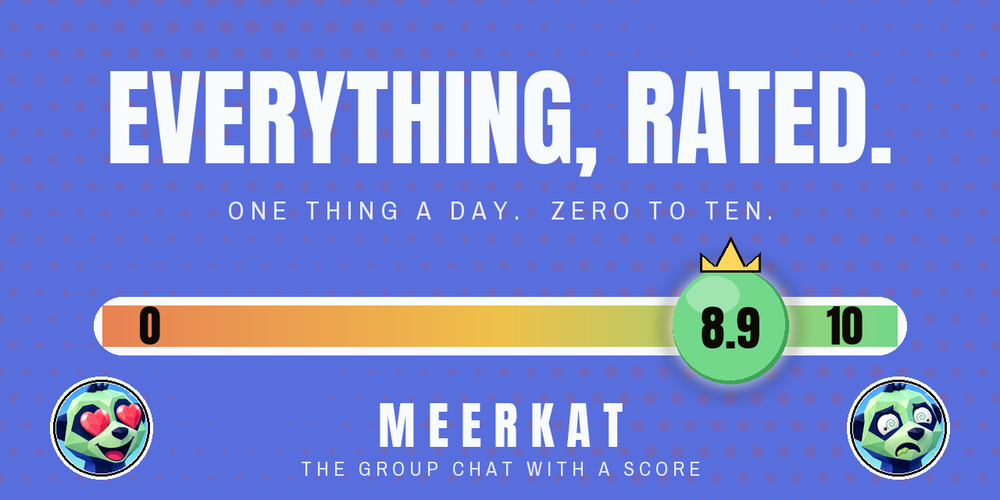
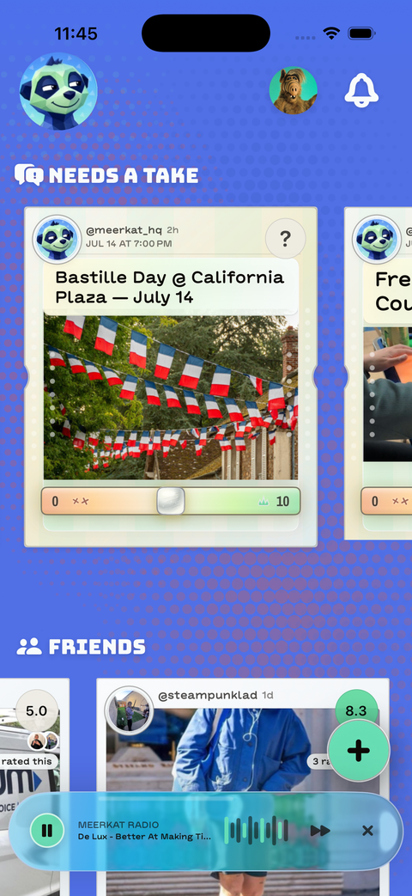
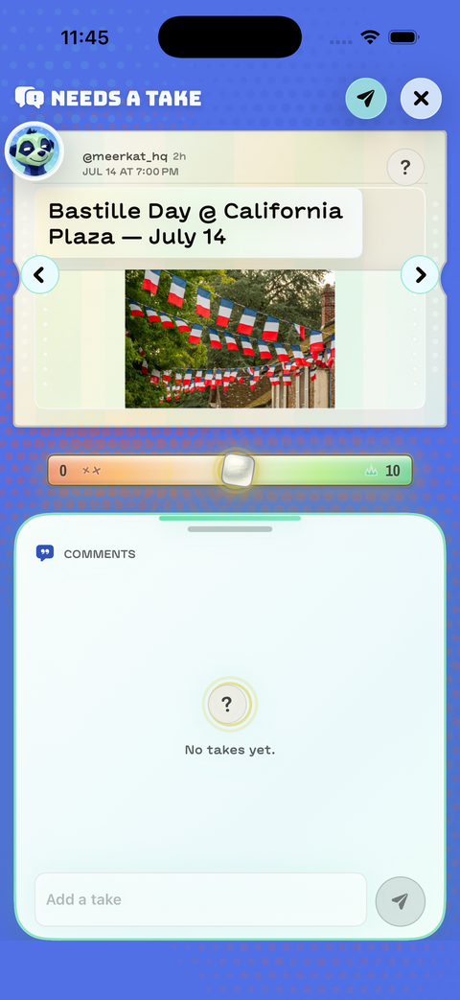
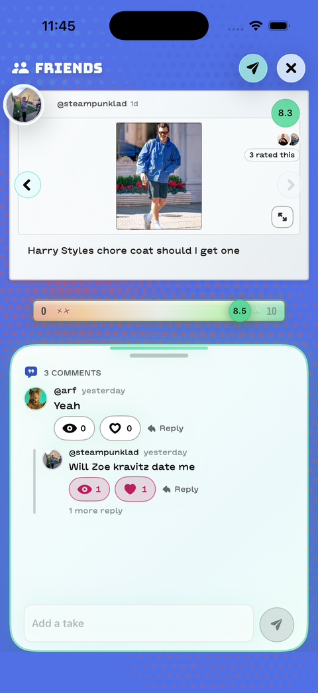
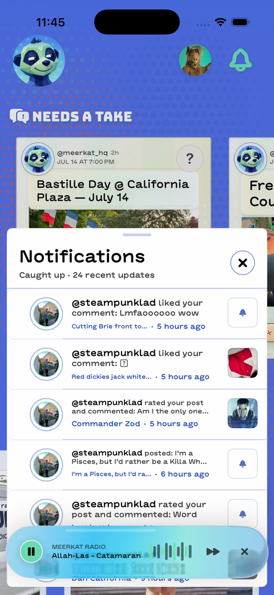

  

# Meerkat

**the group chat with a score.** An iOS app where friends rate everyday stuff 0 to 10. You commit your score before you see anyone else's.

> Live on the App Store · current release in review · 120+ builds shipped · live AWS backend

Meerkat is a two-person passion project. A friend drives the product; I build it. This repo is the engineering devlog — stack, performance notes, screenshots from the live build. The app itself is closed source.

  
  
  
  

## Stack

| Layer | |
|---|---|
| iOS | SwiftUI, ~109k lines. 120Hz interaction budget. Feed scroll runs on pre-rasterized card snapshots with pixel-parity swap rules. |
| Backend | Node 22, ~15k lines, dependency-light. Postgres, 31 hand-written migrations. Dual store (Postgres + in-memory) so the ~11k-line API test suite runs with zero infrastructure. |
| Platform | AWS App Runner, RDS Postgres, S3 media with presigned uploads, APNs push. |
| Analytics | Typed event contracts written to Postgres. Drives release smoke checks and a score-inflation canary. |
| Release | Scripted TestFlight pipeline: build-number audit, device screenshot runs, live-backend health gates. 120+ internal builds since March 2026; live on the App Store. |

~1,350 commits since March. Built with a modern AI-assisted toolchain, the same way it'll be maintained; every change works from a written spec and gets reviewed and verified on device before it ships.

## Notes

- [Shimmer-free scrolling](notes/shimmer-free-scrolling.md) — swapping live SwiftUI cards for baked bitmaps mid-scroll without a visible pixel of difference.
- [Read-time privacy enforcement](notes/read-time-enforcement.md) — a retroactive privacy toggle with no migration and no backfill, plus the canary that watches for score inflation.
- [The coin at 120Hz](notes/the-coin.md) — cartoon drag physics on the rating dial without dropping a ProMotion frame.

---

Kevin Showkat · [GitHub](https://github.com/kevinshowkat) · [LinkedIn](https://www.linkedin.com/in/kshowkat/) · [showkatkevin@gmail.com](mailto:showkatkevin@gmail.com)
